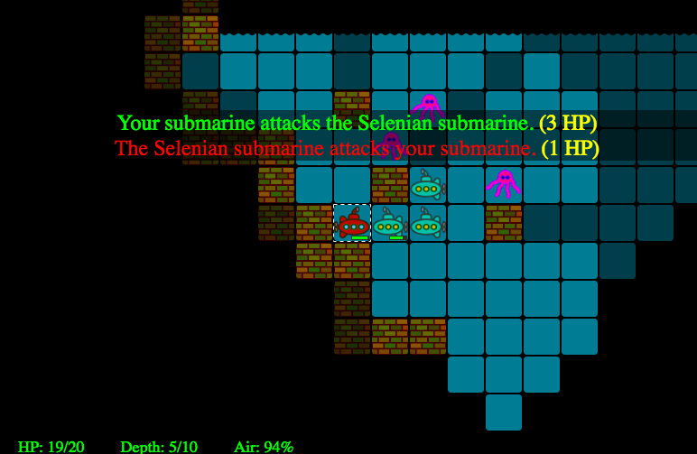

# sublunar
Roguelike game about exploring the underground oceans on the Moon.



The game is not yet winnable (or loose-able, for that matter;-)).
It currently has "tech demo" status.

You can try it [here](https://stephanh42.github.io/sublunar/).

## Key bindings

You can either use the traditional VI/Roguelike keys or the numpad keys.

```
       y k u             1 2 3
       h   l             4   6
       b j n             7 8 9

     traditional         numpad
    VI/Roguelike
```

The arrow keys also work but those don't allow you to move diagonally.
You can also click with the mouse on a tile adjacent to your submarine.

* Use + and - to zoom in/zoom out.
* Press t to fire a torpedo.

## Background story

The game plays in an alternate universe, in which at the turn of the 20th
century radio signals were received from the Moon. Thereby the Great Powers of
Earth discovered about the ancient but decadent civilization of the Moon.

A long time ago, when the Moon gradually lost its originally atmosphere, a
great project was started by the Lunarians to build immense underground caverns,
shielded from the vacuum of outer space. Into these caverns the ancient oceans on
the Moon were redirected. 

While the remnants of the Lunarian civilization still persevere in along
the underground coasts of the ocean, most of their technology was lost. 
Much of this technology may still be recovered from the bottom of the
sub-lunar sea. You have been sent from Earth to by a Great Power to 
discover lost technology, and in particular a mysterious artifact known
as the Orb of Ptah. It has been rumored that recovery of this artifact would
allow a control over the technology of the ancient Lunarians...
